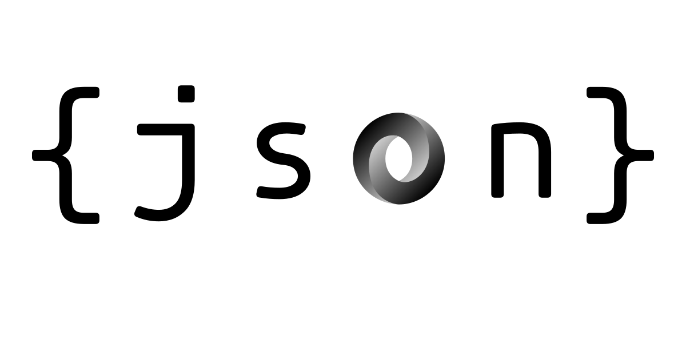

<h1 align="center">Hey there, I'm Yehia Zakaria </h1>

<h3 align="center">Full Stack Web Develpoer </h3>
<h4 align="center"> Full Stack Developer with 3+ years of hands-on experience designing, developing, and implementing applications and solutions  using a range of technologies and programming languages. with Strong background in project management and customer relations. </h3>

## Dynamic Quotes 📜:

 

## **Scan Me**

<h3 align="left">Interests:</h3>

- Front End 📊
- Back End 📊
- Data Structures And Algorithms 💻
- Data Analysis 💻
- Database

<h3 align="left">Languages:</h3>

- Arabic
- English 

  

## 🧠 That I know and use

### 📚 **Langues and Frameworks** 

<h3 align="left">Interests:</h3>

- HTML5
- CSS3, SCSS, SASS
- Material-ui, twiland , Bootstrap
- JavaScript, TypeScript , JQuery
- Vue, Vuex, Vue-Router
- C++
- PHP, Node.js, Laravel, Express
- My Sql , postgresql
- Jasmine.js
- Git, Zoom, Photoshopsh
    

     &nbsp;
     &nbsp;
     &nbsp;
     &nbsp;
     &nbsp;
     &nbsp;
     &nbsp;
     &nbsp;
     &nbsp;
     &nbsp;
     &nbsp;
     &nbsp;
     &nbsp;
     &nbsp;
     &nbsp;
     &nbsp;
     &nbsp;
     &nbsp;

    

      

## 💡 Projects   

- [Portfolio](https://yehiazzz.com/)
- [PHI-Portal](https://phi.edu.eg/)
- [PHI-LMS](https://www.elearning.phi.edu.eg/)
- [PHI-HR](https://hr.phi.edu.eg/)
- [CPS-Portal](https://www.cps-education.com/)
- [CPS-LMS](http://elearning.cps-education.com/)
- [CPIS-Portal](http://cpischools.com/)

<h2  > Connect with me</h2>

- [Portfolio](https://yehiazzz.com/)
- [Mail](yehiazakariaaz@gmail.com) : yehiazakariaaz@gmail.com
- [LinkedIn](https://www.linkedin.com/in/yehia-zakaria/)
- [Github](https://github.com/yehiazzz/)
- [WhatsApp](https://api.whatsapp.com/send/?phone=201272184866&text&app_absent=0)

    
